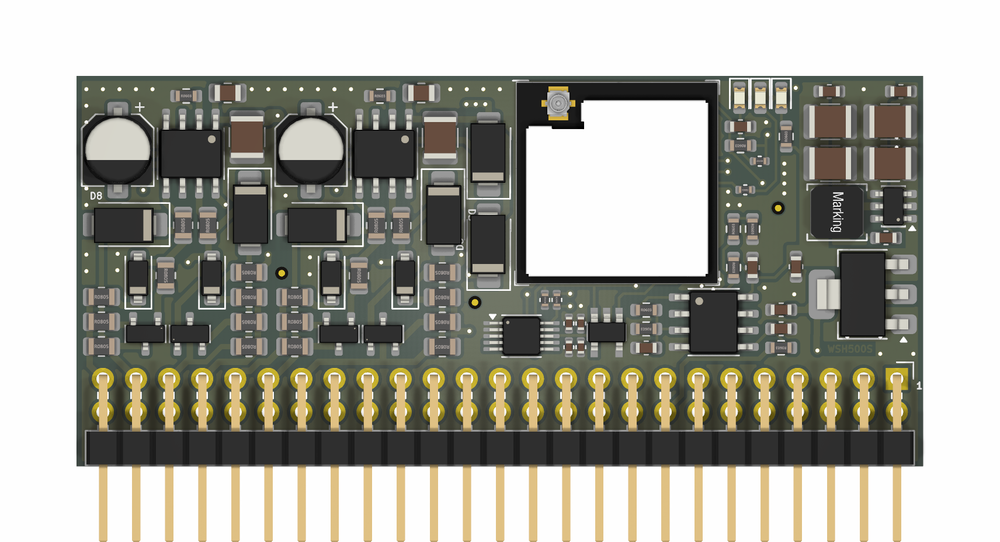
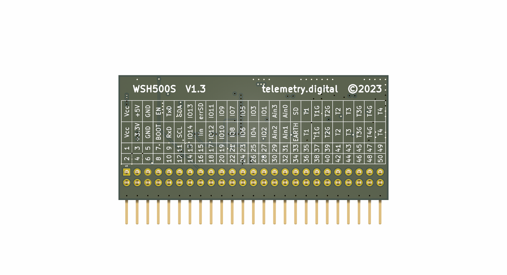

# stepSOLAR

**Solar Water Heater Inverter Controller** · ESP32-S3 · MPPT · Web UI · Modbus RTU · ESPHome

[](https://github.com/palo-krnac/stepSOLAR/releases)
[](https://docs.espressif.com/projects/esp-idf/en/latest/esp32s3/)
[](https://platformio.org/)
[](LICENSE)
[](https://stepsolar.telemetry.digital)

---

stepSOLAR converts DC power from photovoltaic panels into AC rectangular waveform with variable duty cycle to heat water in a boiler. It runs on ESP32-S3, implements MPPT (Perturb & Observe), and provides a responsive web dashboard with real-time monitoring.

| Component | Part |
|-----------|------|
|  | |

## Features

- ⚡ **MPPT P&O algorithm** with automatic VA curve scan
- 🌐 **Responsive web UI** — real-time WebSocket telemetry, power history chart
- 🕐 **NTP time sync** — configurable timezone and DST
- 📡 **Modbus RTU slave** over RS485 — configurable baud/parity/stop
- 🏠 **ESPHome / Home Assistant** integration
- 🌍 **4 languages** — EN / SK / PL / CS
- 💾 **24LC64 EEPROM** with wear-leveling for energy counter
- 🔧 **Dual-core FreeRTOS** — control on Core 0, WiFi on Core 1

## Hardware

| Component | Part |
|-----------|------|
| MCU | ESP32-S3-DevKitC-1 (8 MB Flash) |
| ADC | ADS1115 16-bit (I2C 0x48) |
| EEPROM | 24LC64 64 kB (I2C 0x50) |
| PWM | 2× LEDC 50 Hz 11-bit (GPIO 17, 18) |
| RS485 | MAX485 / SP3485 (UART2) |
| Temp sensor | KTY81/210 NTC |

## Quick Start

```bash
# Clone
git clone https://github.com/palo-krnac/stepSOLAR.git
cd stepSOLAR

# Flash firmware
pio run -t upload

# Flash web UI
pio run -t uploadfs
```

Connect to WiFi AP **`stepSOLAR`** / **`solar2024`** → open **http://192.168.4.1**

## Project Structure

```
stepSOLAR/
├── src/
│   └── main.cpp              # FreeRTOS tasks, setup, WiFi, NTP
├── include/
│   ├── config.h              # GPIO, EEPROM map, Config struct
│   ├── eeprom24.h            # 24LC256 driver, wear-leveling
│   ├── measurement.h         # ADS1115, KTY81 temperature
│   ├── mppt.h                # P&O MPPT, LEDC PWM
│   ├── modbus_handler.h      # Modbus RTU slave, RS485
│   ├── ntp_time.h            # NTP sync, timezone
│   ├── i18n.h                # EN/SK/PL/CS translations
│   └── webserver.h           # AsyncWebServer, WebSocket API
├── data/
│   └── index.html            # Web UI (LittleFS)
├── platformio.ini
└── docs/                     # MkDocs documentation source
```

## Web Interface

| Tab | Content |
|-----|---------|
| Monitor | Live power, voltage, current, duty cycle bar, temperature, 60s power chart |
| Control | Manual duty cycle, AUTO MPPT, VA test, energy set |
| Settings | All parameters — limits, calibration, Modbus RS485, language |
| WiFi | SSID/password, connection status |
| Time | NTP server, timezone, DST, manual sync |

## Modbus Register Map

| Register | Address | Description | Unit |
|----------|---------|-------------|------|
| `nodeID` | 0x0000 | Slave ID | — |
| `napeti` | 0x0004 | PV Voltage | V |
| `proud` | 0x0005 | PV Current ×100 | A |
| `vykon` | 0x0006 | Power | W |
| `teplota` | 0x0007 | Boiler temp | °C |
| `vyroba_lo` | 0x000C | Energy LO word | Wh |
| `vyroba_hi` | 0x000D | Energy HI word | Wh |

## Documentation

Full documentation at **[stepsolar.telemetry.digital](https://stepsolar.telemetry.digital)**

## Changelog

See [CHANGELOG.md](docs/changelog/changelog.md) or the [docs site](https://stepsolar.telemetry.digital/changelog/changelog/).

## License

MIT — see [LICENSE](LICENSE)

## Author

**Palo Krnac** — [github.com/palo-krnac](https://github.com/palo-krnac)

---
