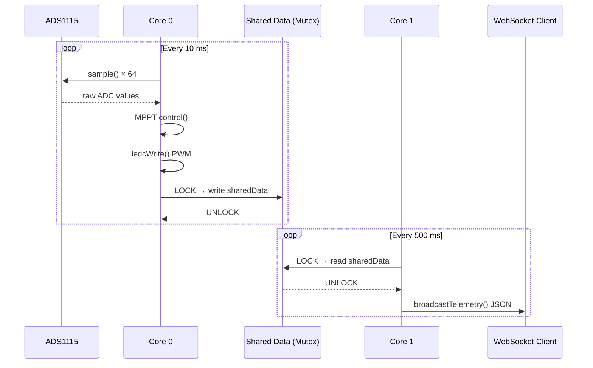

# Firmware Architecture

## File Structure

```
stepSOLAR/
├── platformio.ini
├── src/
│   └── main.cpp              # Setup, FreeRTOS tasks, WiFi
├── include/
│   ├── config.h              # GPIO, EEPROM addresses, Config struct
│   ├── eeprom24.h            # 24LC256 driver + VyrobaStore
│   ├── measurement.h         # ADS1115 sampling, KTY81 calc
│   ├── mppt.h                # MPPT P&O algorithm, LEDC PWM
│   ├── modbus_handler.h      # Modbus RTU slave
│   ├── ntp_time.h            # NTP sync, timezone
│   ├── i18n.h                # Translation table (EN/SK/PL/CS)
│   └── webserver.h           # AsyncWebServer + WebSocket API
└── data/
    └── index.html            # Web UI (LittleFS)
```

## Module Responsibilities

| Module | Core | Responsibility |
|--------|------|----------------|
| `measurement.h` | 0 | ADS1115 sampling, sensor calculations |
| `mppt.h` | 0 | P&O algorithm, LEDC PWM output |
| `modbus_handler.h` | 0 | RS485 frame parsing, register updates |
| `ntp_time.h` | 1 | NTP sync, timezone, time string |
| `webserver.h` | 1 | HTTP API, WebSocket broadcast |
| `eeprom24.h` | 1 | EEPROM read/write, wear-leveling |
| `i18n.h` | 1 | Translation lookup |

## Data Flow


