# Hardware Overview

## Block Diagram

```mermaid
graph TD
    PV[PV Panel] -->|DC| INV[H-Bridge / Gate Driver]
    INV -->|AC 50Hz| BOILER[Water Heater]

    subgraph ESP32-S3
        C0[Core 0\nMPPT + PWM]
        C1[Core 1\nWiFi + Web]
    end

    ADS[ADS1115\n16-bit ADC] -->|I2C| C0
    EE[24LC256\n32kB EEPROM] -->|I2C| C1
    RS485[RS485 Transceiver] -->|UART2| C0

    C0 -->|LEDC PWM\nGPIO17/18| INV
    ADS -->|CH0 Current| ADS
    ADS -->|CH1 Voltage| ADS
    ADS -->|CH2 Temperature| ADS

    C1 -->|HTTP/WS| BROWSER[Web Browser]
    C1 -->|MQTT/API| HA[Home Assistant]
    C0 -->|Modbus RTU| SCADA[SCADA / PLC]

    style ESP32-S3 fill:#192319,stroke:#3DD639
    style PV fill:#1a2a1a,stroke:#3DD639
    style BOILER fill:#1a1a2a,stroke:#4a9eff
```



## GPIO Pin Mapping

| GPIO | Function | Direction | Notes |
|------|----------|-----------|-------|
| 8 | I2C SDA | Bidirectional | ADS1115 + 24LC256 |
| 9 | I2C SCL | Output | 400 kHz |
| 17 | PWM A | Output | LEDC ch0, 50 Hz, 11-bit |
| 18 | PWM B | Output | LEDC ch1, complementary |
| 15 | RS485 TX (DI) | Output | UART2 |
| 16 | RS485 RX (RO) | Input | UART2 |
| 14 | RS485 DE+RE | Output | HIGH = transmit |
| 4 | Enable input | Input (pull-up) | LOW = operation allowed |
| 5 | Overcurrent flag | Input | LOW = fault active |
| 6 | Overcurrent reset | Output | Momentary HIGH pulse |
| 2 | Run LED | Output | Blinks 1×/s |

## PWM Output

Two complementary 50 Hz PWM signals with hardware deadtime:

```
GPIO17  ───▄▄▄▄▄___________▄▄▄▄▄
GPIO18  __________▄▄▄▄▄___________
         ◄── DT ──►◄── DT ──►
         DT ≈ 2 ms (4 LEDC ticks at 11-bit/50Hz)
```

!!! warning "Gate driver required"
    GPIO 17/18 output 3.3V logic levels. Use an isolated gate driver (IR2104, UCC27524, or similar) between the ESP32 and power MOSFETs. Never connect the ESP32 directly to high-voltage gate circuits.

## Voltage Divider for PV Voltage

The PV panel voltage is scaled down using a resistive divider:

```
PV+ ──[470kΩ]──┬──[5.6kΩ]── GND
               │
            ADS1115 AIN1
```

**Scale factor:** `(470000 + 5600) / 5600 = 84.93×`

For a panel with Voc = 400 V:  `400 / 84.93 = 4.71 V` — within ADS1115 ±4.096V GAIN_ONE range.

!!! danger "High voltage"
    The divider operates at panel voltage. Use appropriate rated resistors (≥ 1/2W, high-voltage rated) and maintain safe clearance distances on PCB.
